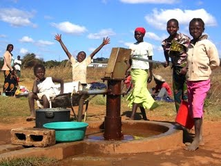
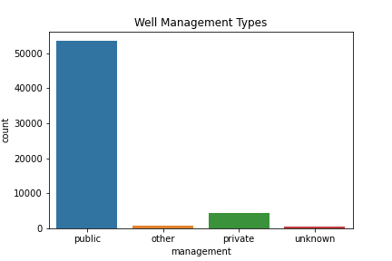
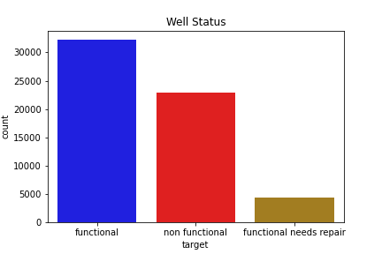

# Predicting Broken Wells in Tanzania

*photo courtesy of [Tanzania Water Aid Project](https://sites.google.com/site/tanzaniawateraidproject/two-solutions)

# Understanding the Problem

Clean water is crucial to the Tanzanian people.  Rain comes only seasonally, with long wet and dry seasons, and many water sources are seasonal as well.  Unclean water is responsible for many deaths from typhoid and other diseases.  

>4 million people in Tanzania lack access to an improved source of safe water, and 30 million don't have access to improved sanitation. People living under these circumstances, >particularly women and girls, spend a significant amount of time traveling long distances to collect water. 1

We are using the Pump it Up: Data Mining the Water Table2 dataset from the Driven Data competition.  This dataset has information about wells in Tanzania recorded between 2002 and 2013.  This features of this dataset include information about when, how, and who constructed the wells, where they are located, what methods they use to extract and distribute water, water quality and quanitity, as well as how the wells are managed and how the people pay for the water they take.

A large number of organizations have funded and installed wells in the country, but most are managed locally by village water associations and trusts.  Some are managed by companies or private individuals.

The wells have also not been uniformly distributed, as you can see on the map below.  It seems certain regions have attracted more projects than others.

The blue dots are functioning wells (as of 2013) and the red dots are broken wells.  You can see how well projects have been focused in certain regions with large tracts mostly neglected.  The shade of green or yellow of each region indicates the total population of that region.  While in some cases the density of wells correlates with the population, in others it does not.

The good news is that most wells in Tanzania were functioning in 2013, and innovations such as solar powered wells have reduced the cost of operation and maintenance of many wells.  However, disrepair is still an issue in many places and well maintenance can save many lives from starvation, thirst, and water-borne disease.

# Understanding The Data

The dataset we used contains volumnious and often redundant information about each well.  Many features were mostly redundant, such as `water_quality` and `water_quality_group` or `scheme_management` and `management`.  Others had too many categorical values to encode, or were so specific to each well as to be of little use in making predictions such as `scheme_name` or `installer`. Here is a comprehensive description of each feature:

## Features:
1. `amount_tsh`: total static head.  How high the water gets pumped from where it starts.
2. `date_recorded`: when this row was updated/created
3. `funder`: who funded the well
4. `gps_height`: altitude of well
5. `installer`: who installed the well
6. `latitude`/`longitude`: location of well
7. `wpt_name`: name of the waterpoint (well)
8. `basin`: geographic water basin
9. `subvillage`: village or street, see Regional subdivisions in Tanzania below
10. `region`: see Regional subdivisions in Tanzania below
11. `region code`: 
12. `district code`:
13. `lga`: district, see Regional subdivisions in Tanzania below
14. `ward`: see Regional subdivisions in Tanzania below
15. `population`: population around well (subvillage?)
16. `public meeting`: ? (true/false/NaN)
17. `recorded_by`: group entering data for this row
18. `scheme_management`: type of management.  (see Water Management Types below)
19. `scheme_name`: name of well management group
20. `permit`: is permitted by local water basin authority
21. `construction_year`: year constructed
22. `extraction_type`: specific extraction method
23. `extraction_type_group`: less specific than extraction_type
24. `extraction_type_class`: broadest class of extraction type
25. `management`: how well is managed: see Water Management Types below
26. `management_group`: broader type of management: see Water Management Types below
27. `payment`/`payment_type`: how the water is paid for.
28. `water_quality`: description of water from well
29. `quality_group`: less specific quality type.
30. `quantity`/`quantity_group`: how much water or when there is water
31. `source`/`source_type`/`source_class`: where the water from the well comes from 
32. `waterpoint_type`/`waterpoint_type_group`: type of extraction point, what users interact with to get water.

### Redundant Features:
1. basin, subvillage, region, region code, district code, lga, ward: 
2. water_quality, and quality_group
3. quantity, quantity group
4. source, source_type, source_class
5. waterpoint_type, waterpoint_type_group
6. payment, payment_type
7. management, management_group, scheme_management
8. extraction_type, extraction_type_class, extraction_type_group

And here we offer some additional explanation to understand some of these features, taken from outside sources:

### Water Management Types: 3

*Village Water Committee* – Initiated as a formalised water point management structure in the 1991
Water Policy, these bodies continue to exist in all villages visited in Dodoma (although not in
Singida) as a regulatory body with elected membership. They are effectively the default
management framework across the three regions. The VWC is a cosignatory with the DWE to the
village water fund.

*Private Operator* – An individual or group that is contracted by the VWC or other official body to
undertake operation and some maintenance of the extraction system or single DP for an
arranged fee. Tenderer is sometimes used as an alternative name; Wakala is the official term in
Dodoma Rural and some other areas; Mpwapwa more commonly uses Mbia, or ‘caretakers’.

*Water User Association* – A legal entity autonomous from village government that oversees the
management of an entire extraction system. The WUA has its own fund which functions as the
village water fund. Officially, it will have authority over the Water User Groups (WUGs) using the
water source.

*Water User Group* – These are the sub-village level management groups that are responsible for
operation and maintenance of specific DPs within a WUA. In practice, sub-villages do not always
create WUGs so management will revert to the WUA. Has its own bank account to fund small
repairs and regular maintenance.

*School* – Refers to extensions of systems to schools. The water points are public but managed fully
by the school and are often obligated to pay a contribution to the village water fund.

*Private* – A privately funded extension to a water system. The owner may sell on the water and often
must allow public access to any DP on the private system.

*Company* – A legal entity sometimes under contract.

*Board/Trust* – Also a legal entity, autonomous from village government that takes the place of VWCs.

*Government* – Only very few DPs of this type exist and they are almost exclusively in Iramba district,
Singida. While there is no first hand evidence to explain this system it most probably describes a
take-over by village government in the absence of a VWC or other management type. 

**Additional**

*Parastatal* -- Corporate held, in contract with the government.

*SWC* -- Soil and water conservation(?)

### Regional subdivisions in Tanzania: 4

The administrative divisions of Tanzania are controlled by Part I, Article 2.2 of the Constitution of Tanzania.[1] 

* Tanzania is divided into thirty-one regions (mkoa in Swahili). 

* Each region is subdivided into districts (wilaya in Swahili). 

* The districts are sub-divided into divisions (tarafa in Swahili) and

* further into local wards (kata in Swahili). 

* Wards are further subdivided for management purposes: for urban wards into streets (mtaa in Swahili) and for rural wards into villages (kijiji in Swahili). 

* The villages may be further subdivided into hamlets (vitongoji in Swahili).

For a comprehensive explanation of each feature in the dataset, see our report notebook in the report folder.

# Preparing the Data

After dropping highly specific or redundant features, we scaled the numeric data so each features' values were comparable to each other.  This helps prediction models to compare features evenly without losing information.  `date_recorded` was originally full of strings of dates, but we transformed them into numbers with the whole number as the year and the decimal representing the months (1/month).  We imputed missing values We one-hot-encoded categorical features, creating a binary column for each category within them.  Algorithmic models can only understand numbers.  

# The Models

We hope our predictive model will assist governmental and aid organizations in targeting failed wells for maintenance. Clean and functional wells save lives.

## References:
1 "Tanzania's Water and Sanitation Crisis" [water.org](https://water.org/our-impact/where-we-work/tanzania/)

2 "Pump it Up: Data Mining the Water Table" [DrivenData.org](https://www.drivendata.org/competitions/7/pump-it-up-data-mining-the-water-table/page/23/)

3[PRIVATE OPERATION IN THE RURAL WATER SUPPLY IN CENTRAL TANZANIA: QUICK FIXES AND SLOW TRANSITIONS](https://washmatters.wateraid.org/publications/private-operation-in-the-rural-water-supply-in-central-tanzania-quick-fixes-and-slow)

4 "Subdivisions of Tanzania" [wikipedia](https://en.wikipedia.org/wiki/Subdivisions_of_Tanzania)
