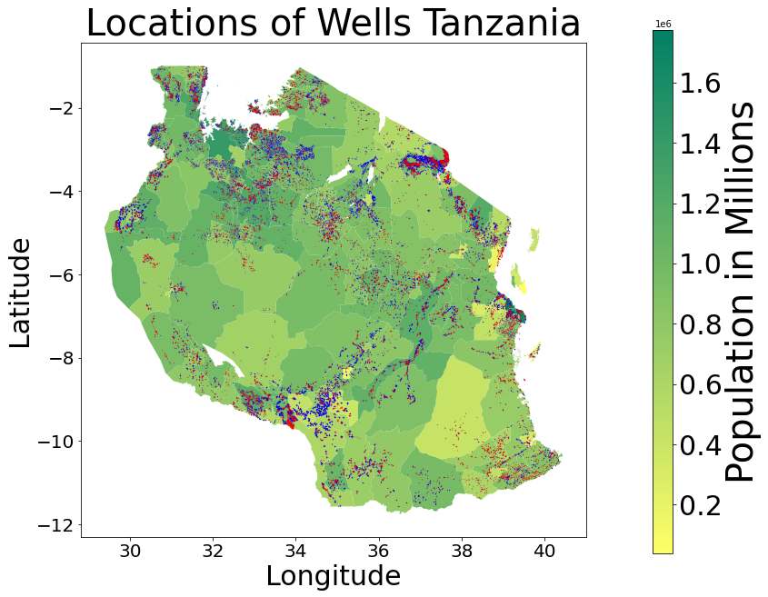

# Predicting Broken Wells in Tanzania

*photo courtesy of [Tanzania Water Aid Project](https://sites.google.com/site/tanzaniawateraidproject/two-solutions)

Clean water is crucial to the Tanzanian people.  Rain comes only seasonally, with long wet and dry seasons, and many water sources are seasonal as well.  Unclean water is responsible for many deaths from typhoid and other diseases.  

>4 million people in Tanzania lack access to an improved source of safe water, and 30 million don't have access to improved sanitation. People living under these circumstances, >particularly women and girls, spend a significant amount of time traveling long distances to collect water. 1

We are using the Pump it Up: Data Mining the Water Table2 dataset from the Driven Data competition.  This dataset has information about wells in Tanzania recorded between 2002 and 2013.  This features of this dataset include information about when, how, and who constructed the wells, where they are located, what methods they use to extract and distribute water, water quality and quanitity, as well as how the wells are managed and how the people pay for the water they take.

The wells in the country are not uniformly distributed, as you can see on the map below.

A large number of organizations have funded and installed wells in the country, but most are managed locally by village water associations and trusts.  Some are managed by companies or private individuals.

which is several years old. The most recent entry is from 2013.  Some innovations have been made since then, including solar powered wells to replace diesel pumps, but the best technology only helps when it works.  

We hope our predictive model will assist governmental and aid organizations in targeting failed wells for maintenance. Clean and functional wells save lives.

## References:
1 "Tanzania's Water and Sanitation Crisis" [water.org](https://water.org/our-impact/where-we-work/tanzania/)

2 Pump it Up: Data Mining the Water Table" [DrivenData.org](https://www.drivendata.org/competitions/7/pump-it-up-data-mining-the-water-table/page/23/)
